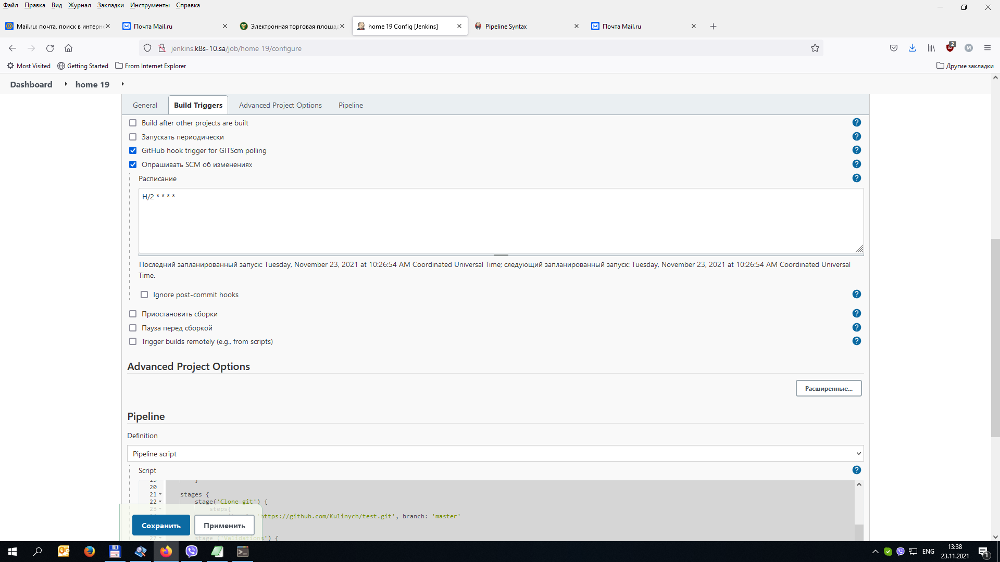

# 19.Jenkins.Docker


### Console output

```groovy
Started by user admin
[Pipeline] Start of Pipeline
[Pipeline] podTemplate
[Pipeline] {
[Pipeline] node
Created Pod: kubernetes ci-cd/home-19-30-rbk58-2dcmg-lwkd4
[Normal][ci-cd/home-19-30-rbk58-2dcmg-lwkd4][Scheduled] Successfully assigned ci-cd/home-19-30-rbk58-2dcmg-lwkd4 to node1
[Normal][ci-cd/home-19-30-rbk58-2dcmg-lwkd4][Pulled] Container image "garethr/kubeval:latest" already present on machine
[Normal][ci-cd/home-19-30-rbk58-2dcmg-lwkd4][Created] Created container kubeval
[Normal][ci-cd/home-19-30-rbk58-2dcmg-lwkd4][Started] Started container kubeval
[Normal][ci-cd/home-19-30-rbk58-2dcmg-lwkd4][Pulled] Container image "jenkins/inbound-agent:4.3-4-jdk11" already present on machine
[Normal][ci-cd/home-19-30-rbk58-2dcmg-lwkd4][Created] Created container jnlp
[Normal][ci-cd/home-19-30-rbk58-2dcmg-lwkd4][Started] Started container jnlp
Still waiting to schedule task
Waiting for next available executor on ‘home-19-30-rbk58-2dcmg-lwkd4’
Agent home-19-30-rbk58-2dcmg-lwkd4 is provisioned from template home_19_30-rbk58-2dcmg
---
apiVersion: "v1"
kind: "Pod"
metadata:
  annotations:
    buildUrl: "http://jenkins:8080/job/home%2019/30/"
    runUrl: "job/home%2019/30/"
  labels:
    jenkins: "slave"
    jenkins/label-digest: "00c0a5a159e83a3d55834e620067d7fbbd4a14b1"
    jenkins/label: "home_19_30-rbk58"
  name: "home-19-30-rbk58-2dcmg-lwkd4"
spec:
  containers:
  - command:
    - "watch"
    - "date"
    image: "garethr/kubeval:latest"
    imagePullPolicy: "IfNotPresent"
    name: "kubeval"
    tty: true
    volumeMounts:
    - mountPath: "/home/jenkins/agent"
      name: "workspace-volume"
      readOnly: false
  - env:
    - name: "JENKINS_SECRET"
      value: "********"
    - name: "JENKINS_AGENT_NAME"
      value: "home-19-30-rbk58-2dcmg-lwkd4"
    - name: "JENKINS_NAME"
      value: "home-19-30-rbk58-2dcmg-lwkd4"
    - name: "JENKINS_AGENT_WORKDIR"
      value: "/home/jenkins/agent"
    - name: "JENKINS_URL"
      value: "http://jenkins:8080/"
    image: "jenkins/inbound-agent:4.3-4-jdk11"
    name: "jnlp"
    resources:
      limits: {}
      requests:
        memory: "256Mi"
        cpu: "100m"
    volumeMounts:
    - mountPath: "/home/jenkins/agent"
      name: "workspace-volume"
      readOnly: false
  nodeSelector:
    kubernetes.io/os: "linux"
  restartPolicy: "Never"
  volumes:
  - emptyDir:
      medium: ""
    name: "workspace-volume"

Running on home-19-30-rbk58-2dcmg-lwkd4 in /home/jenkins/agent/workspace/home 19
[Pipeline] {
[Pipeline] stage
[Pipeline] { (Clone git)
[Pipeline] git
The recommended git tool is: NONE
No credentials specified
Cloning the remote Git repository
Cloning repository https://github.com/Kulinych/test.git
 > git init /home/jenkins/agent/workspace/home 19 # timeout=10
Fetching upstream changes from https://github.com/Kulinych/test.git
 > git --version # timeout=10
 > git --version # 'git version 2.20.1'
 > git fetch --tags --force --progress -- https://github.com/Kulinych/test.git +refs/heads/*:refs/remotes/origin/* # timeout=10
Avoid second fetch
Checking out Revision ab2dddabf063aed9ce2ec1117ebb48037606da2b (refs/remotes/origin/master)
 > git config remote.origin.url https://github.com/Kulinych/test.git # timeout=10
 > git config --add remote.origin.fetch +refs/heads/*:refs/remotes/origin/* # timeout=10
 > git rev-parse refs/remotes/origin/master^{commit} # timeout=10
 > git config core.sparsecheckout # timeout=10
 > git checkout -f ab2dddabf063aed9ce2ec1117ebb48037606da2b # timeout=10
 > git branch -a -v --no-abbrev # timeout=10
 > git checkout -b master ab2dddabf063aed9ce2ec1117ebb48037606da2b # timeout=10
Commit message: "Create Deploy1.yaml"
 > git rev-list --no-walk ab2dddabf063aed9ce2ec1117ebb48037606da2b # timeout=10
[Pipeline] }
[Pipeline] // stage
[Pipeline] stage
[Pipeline] { (Validations)
[Pipeline] parallel
[Pipeline] { (Branch: validation Deploy.yaml)
[Pipeline] { (Branch: validation Deploy1.yaml)
[Pipeline] stage
[Pipeline] { (validation Deploy.yaml)
[Pipeline] stage
[Pipeline] { (validation Deploy1.yaml)
[Pipeline] container
[Pipeline] {
[Pipeline] container
[Pipeline] {
[Pipeline] sh
[Pipeline] sh
PASS - Deploy.yaml contains a valid Deployment (nginx-deployment)
[Pipeline] }
PASS - Deploy1.yaml contains a valid Pod (rss-site)
[Pipeline] // container
[Pipeline] }
[Pipeline] }
[Pipeline] // stage
[Pipeline] // container
[Pipeline] }
[Pipeline] }
[Pipeline] // stage
[Pipeline] }
[Pipeline] // parallel
[Pipeline] }
[Pipeline] // stage
[Pipeline] stage
[Pipeline] { (Declarative: Post Actions)
[Pipeline] slackSend
Slack Send Pipeline step running, values are - baseUrl: <empty>, teamDomain: sa-itacademy-by, channel: #coolnoti, color: #00FF00, botUser: false, tokenCredentialId: slack, notifyCommitters: false, iconEmoji: <empty>, username: <empty>, timestamp: <empty>
[Pipeline] }
[Pipeline] // stage
[Pipeline] }
[Pipeline] // node
[Pipeline] }
[Pipeline] // podTemplate
[Pipeline] End of Pipeline
Finished: SUCCESS    
```



## Slack notification


