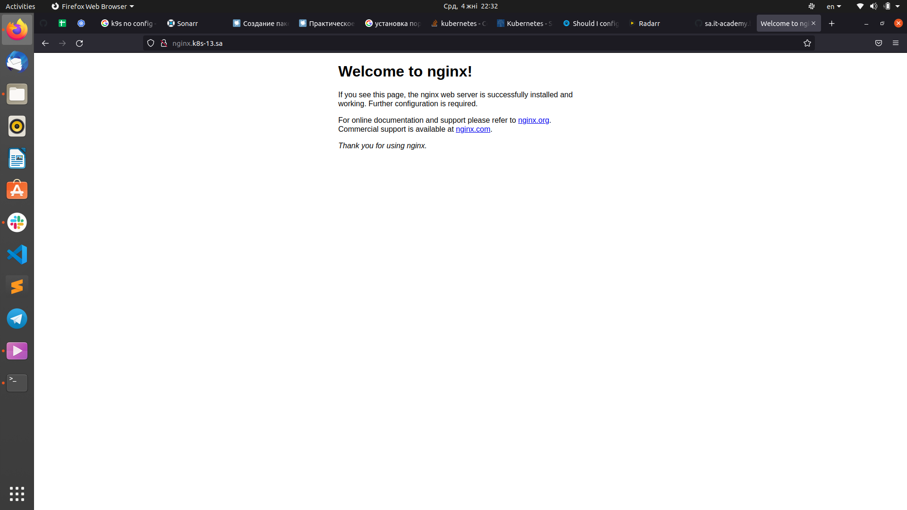
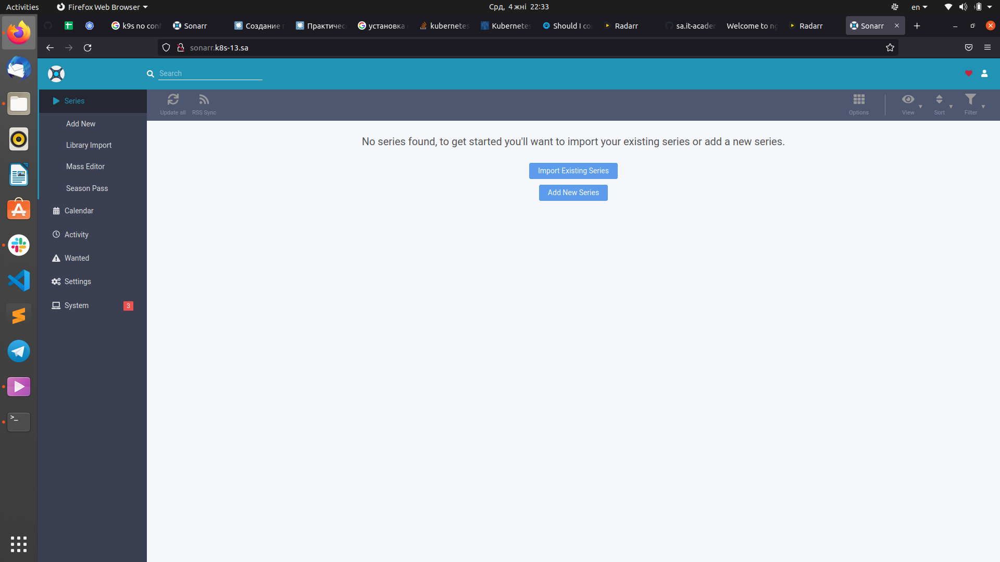
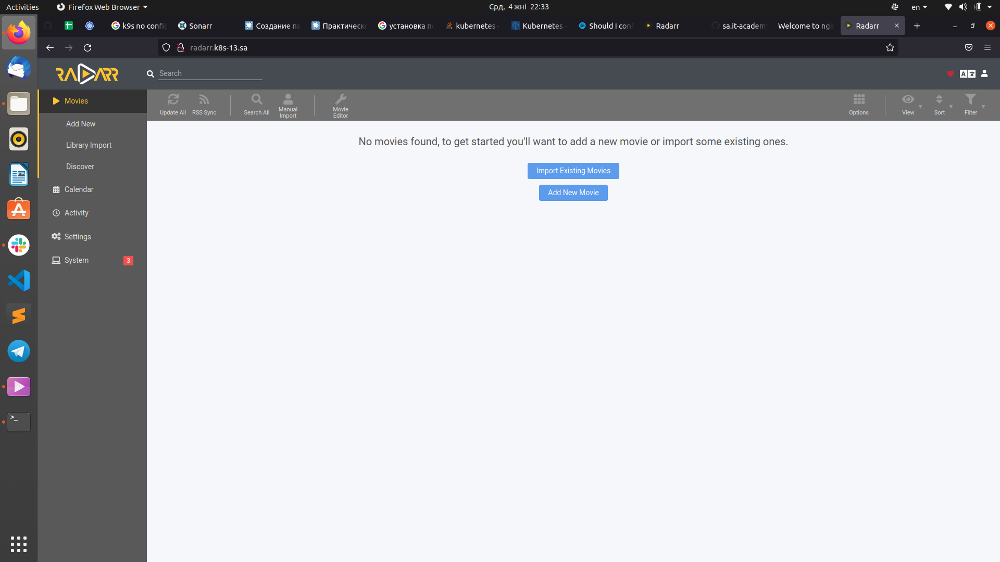
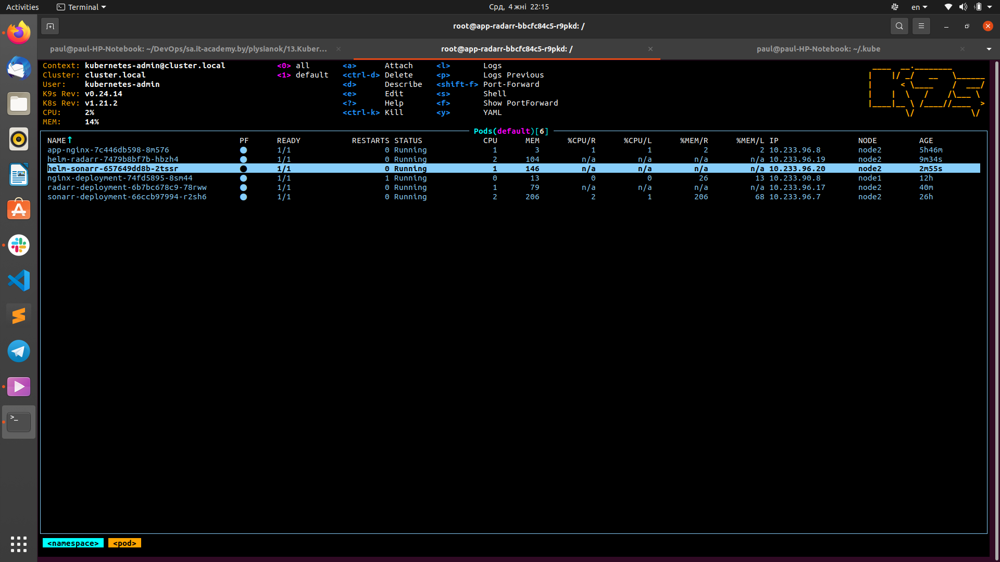

# 13.Kubernetes.manifest
---

## 1)  Create(convert to) manifest for your docker-compose from hometaks 10. Docker-compose, terraform
---
```bash
---
apiVersion: apps/v1
kind: Deployment
metadata:
  name: nginx-deployment
  labels:
    app: nginx
spec:
  replicas: 1
  selector:
    matchLabels:
      app: nginx
  template:
    metadata:
      labels:
        app: nginx
    spec:
      containers:
      - name: nginx
        image: nginx
        ports:
        - containerPort: 80
        resources:
          requests:
            cpu: 50m
            memory: 50Mi
          limits:
            cpu: 100m
            memory: 100Mi
        volumeMounts:
        - name: persistent-storage
          mountPath: "/usr/share/nginx/html"
        - name: test-config-mount
          mountPath: /tmp/test.txt
          subPath: test.txt
      volumes:
      - name: persistent-storage
        persistentVolumeClaim:
          claimName: app01-pv-claim
      - name: test-config-mount
        configMap:
          name: test-config
---
apiVersion: v1
kind: Service
metadata:
  name: nginx-web-service
  labels:
    run: nginx-web-service
spec:
  type: LoadBalancer
  ports:
  - port: 80
    protocol: TCP
  selector:
    app: nginx

---
apiVersion: v1
kind: PersistentVolume
metadata:
  name: app01-pv-volume
  labels:
    type: nfs
    name: app-nfs-vol
spec:
  capacity:
    storage: 1Gi
  accessModes:
    - ReadWriteMany
  persistentVolumeReclaimPolicy: Retain
  nfs:
    path: /mnt/IT-Academy/nfs-data/sa2-17-21/plysianok
    server: 192.168.37.105

---
apiVersion: v1
kind: PersistentVolumeClaim
metadata:
  name: app01-pv-claim
  labels:
    app: simple-web
spec:
  accessModes:
    - ReadWriteMany
  resources:
    requests:
      storage: 1Gi
  selector:
    matchLabels:
      name: app-nfs-vol
      type: nfs

---
apiVersion: v1
kind: ConfigMap
metadata:
  name: test-config
data:
  test.txt: |
    Hi!!!!!!!!!
    Im test!!!
---
apiVersion: apps/v1
kind: Deployment
metadata:
  name: radarr-deployment
  labels:
    app: radarr
spec:
  replicas: 1
  selector:
    matchLabels:
      app: radarr
  template:
    metadata:
      labels:
        app: radarr
    spec:
      containers:
      - name: radarr
        image: linuxserver/radarr
        ports:
        - containerPort: 7878
        env:
          - name: TZ
            value: America/New_York
          - name: PUID
            value: "1000"
          - name: PGID
            value: "1000"
        resources:
          requests:
            cpu: 100m
            memory: 500Mi
          limits:
            cpu: 500m
            memory: 1000Mi

---
apiVersion: v1
kind: Service
metadata:
  name: radarr-service
  labels:
    run: radarr-service
spec:
  type: LoadBalancer
  ports:
  - port: 7878
    protocol: TCP
  selector:
    app: radarr

---
apiVersion: apps/v1
kind: Deployment
metadata:
  name: sonarr-deployment
  labels:
    app: sonarr
spec:
  replicas: 1
  selector:
    matchLabels:
      app: sonarr
  template:
    metadata:
      labels:
        app: sonarr
    spec:
      containers:
      - name: sonarr
        image: linuxserver/sonarr
        ports:
        - containerPort: 8989
        env:
          - name: TZ
            value: America/New_York
          - name: PUID
            value: "1000"
          - name: PGID
            value: "1000"
        resources:
          requests:
            cpu: 100m
            memory: 100Mi
          limits:
            cpu: 200m
            memory: 300Mi

---
apiVersion: v1
kind: Service
metadata:
  name: sonarr-service
  labels:
    run: sonarr-service
spec:
  type: LoadBalancer
  ports:
  - port: 8989
    protocol: TCP
  selector:
    app: sonarr

---
apiVersion: extensions/v1beta1
kind: Ingress
metadata:
  name: ingress-sa
spec:
  backend:
    serviceName: default-http-backend
    servicePort: 80
  rules:
  - host: nginx.k8s-13.sa
    http:
      paths:
      - path: /
        backend:
          serviceName: nginx-web-service
          servicePort: 80
  - host: radarr.k8s-13.sa
    http:
      paths:
      - path: /
        backend:
          serviceName: radarr-service
          servicePort: 7878
  - host: sonarr.k8s-13.sa
    http:
      paths:
      - path: /
        backend:
          serviceName: sonarr-service
          servicePort: 8989
```
---
## 1.1) Deployment test nginx
---

---
## 1.2) Deployment test sonarr
---

---
## 1.3) Deployment test radarr
---

---

## 2) Create Helm chart for application
---
### 2.1) Nginx Helm Chart
---
```bash
# Default values for nginx.
# This is a YAML-formatted file.
# Declare variables to be passed into your templates.

replicaCount: 1

image:
  repository: nginx
  pullPolicy: IfNotPresent
  # Overrides the image tag whose default is the chart appVersion.
  tag: ""

imagePullSecrets: []
nameOverride: ""
fullnameOverride: ""

serviceAccount:
  # Specifies whether a service account should be created
  create: true
  # Annotations to add to the service account
  annotations: {}
  # The name of the service account to use.
  # If not set and create is true, a name is generated using the fullname template
  name: ""

podAnnotations: {}

podSecurityContext: {}
  # fsGroup: 2000

securityContext: {}
  # capabilities:
  #   drop:
  #   - ALL
  # readOnlyRootFilesystem: true
  # runAsNonRoot: true
  # runAsUser: 1000

service:
  type: LoadBalancer
  port: 80

ingress:
  enabled: true
  className: ""
  annotations: {}
    # kubernetes.io/ingress.class: nginx
    # kubernetes.io/tls-acme: "true"
  hosts:
    - host: helm.k8s-13.sa
      paths:
        - path: /
          pathType: ImplementationSpecific
  tls: []
  #  - secretName: chart-example-tls
  #    hosts:
  #      - chart-example.local

resources:
  # We usually recommend not to specify default resources and to leave this as a conscious
  # choice for the user. This also increases chances charts run on environments with little
  # resources, such as Minikube. If you do want to specify resources, uncomment the following
  # lines, adjust them as necessary, and remove the curly braces after 'resources:'.
   limits:
     cpu: 100m
     memory: 128Mi
   requests:
     cpu: 100m
     memory: 128Mi

autoscaling:
  enabled: false
  minReplicas: 1
  maxReplicas: 100
  targetCPUUtilizationPercentage: 80
  # targetMemoryUtilizationPercentage: 80

nodeSelector: {}

tolerations: []

affinity: {}

```
### Test nginx Helm Chart

---
### 2.2) Sonarr Helm Chart
---
```bash
# Default values for helm-sonarr.
# This is a YAML-formatted file.
# Declare variables to be passed into your templates.

replicaCount: 1

image:
  repository: linuxserver/sonarr
  pullPolicy: IfNotPresent
  # Overrides the image tag whose default is the chart appVersion.
  tag: "latest"

imagePullSecrets: []
nameOverride: ""
fullnameOverride: ""

serviceAccount:
  # Specifies whether a service account should be created
  create: true
  # Annotations to add to the service account
  annotations: {}
  # The name of the service account to use.
  # If not set and create is true, a name is generated using the fullname template
  name: ""

podAnnotations: {}

podSecurityContext: {}
  # fsGroup: 2000

securityContext: {}
  # capabilities:
  #   drop:
  #   - ALL
  # readOnlyRootFilesystem: true
  # runAsNonRoot: true
  # runAsUser: 1000

service:
  type: LoadBalancer
  port: 8989

ingress:
  enabled: true
  className: ""
  annotations: {}
    # kubernetes.io/ingress.class: nginx
    # kubernetes.io/tls-acme: "true"
  hosts:
    - host: helm-sonarr.k8s-13.sa
      paths:
        - path: /
          pathType: ImplementationSpecific
  tls: []
  #  - secretName: chart-example-tls
  #    hosts:
  #      - chart-example.local

resources: {}
  # We usually recommend not to specify default resources and to leave this as a conscious
  # choice for the user. This also increases chances charts run on environments with little
  # resources, such as Minikube. If you do want to specify resources, uncomment the following
  # lines, adjust them as necessary, and remove the curly braces after 'resources:'.
  # limits:
  #   cpu: 100m
  #   memory: 128Mi
  # requests:
  #   cpu: 100m
  #   memory: 128Mi

autoscaling:
  enabled: false
  minReplicas: 1
  maxReplicas: 100
  targetCPUUtilizationPercentage: 80
  # targetMemoryUtilizationPercentage: 80

nodeSelector: {}

tolerations: []

affinity: {}
```
### Test Sonarr Helm Chart
---

---
### 2.3) Radarr Helm Chart
---
```bash
# Default values for helm-radarr.
# This is a YAML-formatted file.
# Declare variables to be passed into your templates.

replicaCount: 1

image:
  repository: linuxserver/radarr
  pullPolicy: IfNotPresent
  # Overrides the image tag whose default is the chart appVersion.
  tag: "latest"

imagePullSecrets: []
nameOverride: ""
fullnameOverride: ""

serviceAccount:
  # Specifies whether a service account should be created
  create: true
  # Annotations to add to the service account
  annotations: {}
  # The name of the service account to use.
  # If not set and create is true, a name is generated using the fullname template
  name: ""

podAnnotations: {}

podSecurityContext: {}
  # fsGroup: 2000

securityContext: {}
  # capabilities:
  #   drop:
  #   - ALL
  # readOnlyRootFilesystem: true
  # runAsNonRoot: true
  # runAsUser: 1000

service:
  type: LoadBalancer
  port: 7878

ingress:
  enabled: true
  className: ""
  annotations: {}
    # kubernetes.io/ingress.class: nginx
    # kubernetes.io/tls-acme: "true"
  hosts:
    - host: helm-radarr.k8s-13.sa
      paths:
        - path: /
          pathType: ImplementationSpecific
  tls: []
  #  - secretName: chart-example-tls
  #    hosts:
  #      - chart-example.local

resources: 
  # We usually recommend not to specify default resources and to leave this as a conscious
  # choice for the user. This also increases chances charts run on environments with little
  # resources, such as Minikube. If you do want to specify resources, uncomment the following
  # lines, adjust them as necessary, and remove the curly braces after 'resources:'.
  # limits:
  #   cpu: 100m
  #   memory: 128Mi
  # requests:
  #   cpu: 100m
  #   memory: 128Mi

autoscaling:
  enabled: false
  minReplicas: 1
  maxReplicas: 100
  targetCPUUtilizationPercentage: 80
  # targetMemoryUtilizationPercentage: 80

nodeSelector: {}

tolerations: []

affinity: {}
```
### Test radarr Helm Chart
---

---
## 3) Deploy it in your K8s cluster
---

---

